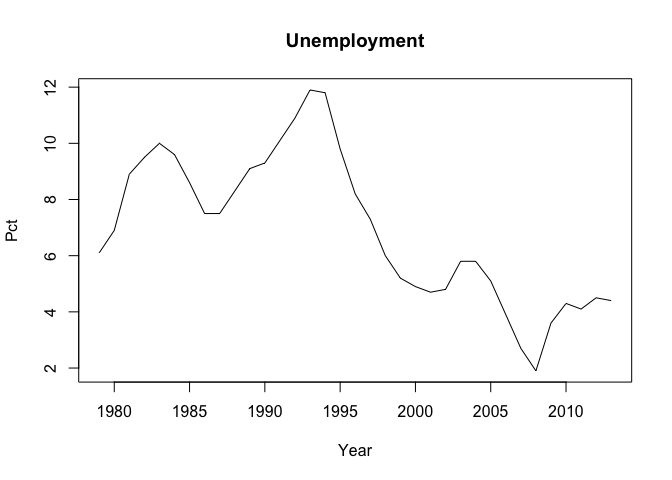

This package connects to the [StatBank](http://www.statistikbanken.dk/statbank5a/) API from [Statistics Denmark](http://www.dst.dk).

This package is in early *BETA* and new changes will most likely not have backward compatibility.

Installation
------------

You can only install the development version from github, using Hadley Wickham's [devtools](http://cran.r-project.org/web/packages/devtools/index.html) package:

    if(!require("devtools")) install.packages("devtools")
    library("devtools")
    install_github("rOpenGov/dkstat")

Examples
--------

Here are a few simple examples that will go through the basics of requesting data from the StatBank and the structure of the output.

First, we'll load the library:

``` r
library(dkstat)
```

Meta data
---------

The dst\_meta function retrieves meta data from the table you wan't to take a closer look at. It can be used to create the final request, but if you can figure out the structure of the query you can define it yourself.

We'll get some meta data from the [AULAAR table](http://www.statistikbanken.dk/AULAAR). The AULAAR table has net unemployment numbers.

``` r
aulaar_meta <- dst_meta(table = "AULAAR", lang = "en")
```

The 'dst\_meta' function returns a list with 4 objects: - basics - variables - values - basic\_query

### Basics

Let's see what the basics contains:

``` r
aulaar_meta$basics
```

    ## $id
    ## [1] "AULAAR"
    ## 
    ## $text
    ## [1] "Net unemployed"
    ## 
    ## $description
    ## [1] "Net unemployed by sex, persons/pct. and time"
    ## 
    ## $unit
    ## [1] "Number"
    ## 
    ## $updated
    ## [1] "2015-06-19T09:00:00"

There's a table id, a short description, a unit description and when the table was updated.

### Variables

The variables in the list has a short description of each variable as well as the id:

``` r
aulaar_meta$variables
```

    ##       id         text
    ## 1    KØN          sex
    ## 2 PERPCT persons/pct.
    ## 3    Tid         time

### Values

The values is a list object of all the variable id's you can use to construct your final query:

``` r
str(aulaar_meta$values)
```

    ## List of 3
    ##  $ KØN   :'data.frame':  3 obs. of  2 variables:
    ##   ..$ id  : chr [1:3] "TOT" "M" "K"
    ##   ..$ text: chr [1:3] "Total" "Men" "Women"
    ##  $ PERPCT:'data.frame':  2 obs. of  2 variables:
    ##   ..$ id  : chr [1:2] "L10" "L9"
    ##   ..$ text: chr [1:2] "Per cent of the labour force" "Unemployed (thousands)"
    ##  $ Tid   :'data.frame':  36 obs. of  2 variables:
    ##   ..$ id  : chr [1:36] "1979" "1980" "1981" "1982" ...
    ##   ..$ text: chr [1:36] "1979" "1980" "1981" "1982" ...

### Basic Query

The basic query is simply a list of the available variables with the first value id for each.

``` r
aulaar_meta$basic_query
```

    ## $KØN
    ## [1] "TOT"
    ## 
    ## $PERPCT
    ## [1] "L10"
    ## 
    ## $Tid
    ## [1] "2014"

Get data
--------

If you know the table ids from the table you can simply supply the request through ...

``` r
aulaar <- dst_get_data(table = "AULAAR", KØN = "TOT", PERPCT = "L10", Tid = 2013,
                       lang = "en", 
                       value_presentation = "ValueAndCode")
str(aulaar)
```

    ## 'data.frame':    1 obs. of  4 variables:
    ##  $ KØN   : chr "Total"
    ##  $ PERPCT: chr "Per cent of the labour force"
    ##  $ TID   : POSIXct, format: "2013-01-01"
    ##  $ value : num 4.4

Let's use the basic\_query from the dst\_meta list to make our first query:

``` r
aulaar <- dst_get_data(table = "AULAAR", 
                       query = aulaar_meta$basic_query,
                       lang = "en", 
                       value_presentation = "ValueAndCode")
str(aulaar)
```

    ## 'data.frame':    1 obs. of  4 variables:
    ##  $ KØN   : chr "Total"
    ##  $ PERPCT: chr "Per cent of the labour force"
    ##  $ TID   : POSIXct, format: "2014-01-01"
    ##  $ value : num 4

This is maybe not really what you want, so let's use the basic\_query to construct a new query that might be better. I still want to have the total and percentage unemployed, but I would like all the observations going back to 1979. I'll now construct the final request, query the StatBank and make a plot.

``` r
aulaar_meta$basic_query$Tid <- aulaar_meta$values$Tid$id

aulaar <- dst_get_data(table = "AULAAR", 
                       query = aulaar_meta$basic_query, 
                       lang = "en", 
                       format = "CSV",
                       value_presentation = "ValueAndCode")

plot(x = aulaar$TID, 
     y = aulaar$value, 
     main = "Unemployment", 
     xlab = "Year", 
     ylab = "Pct", 
     type = "l")
```



If you want the complete timeseries you can write "\*" in the TID variable in the basic\_query or like this:

``` r
aulaar <- dst_get_data(table = "AULAAR", KØN = "TOT", PERPCT = "L10", Tid = "*",
                       lang = "en", 
                       value_presentation = "ValueAndCode")
str(aulaar)
```

    ## 'data.frame':    36 obs. of  4 variables:
    ##  $ KØN   : chr  "Total" "Total" "Total" "Total" ...
    ##  $ PERPCT: chr  "Per cent of the labour force" "Per cent of the labour force" "Per cent of the labour force" "Per cent of the labour force" ...
    ##  $ TID   : POSIXct, format: "1979-01-01" "1980-01-01" ...
    ##  $ value : num  6.1 6.9 8.9 9.5 10 9.6 8.6 7.5 7.5 8.3 ...
