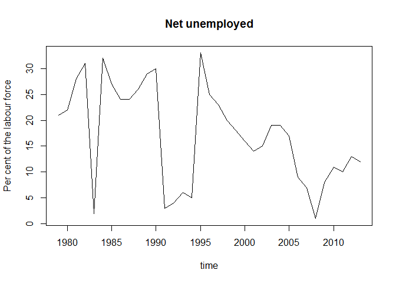

This package connects to the [StatBank](http://www.statistikbanken.dk/statbank5a/) API from [Statistics Denmark](http://www.dst.dk).

Installation
------------

You can only install the development version from github, using Hadley Wickham's [devtools](http://cran.r-project.org/web/packages/devtools/index.html) package:

    if(!require("devtools")) install.packages("devtools")
    library("devtools")
    install_github("krose/dkstat")

Examples
--------

Here are a few simple examples that will go through the basics of requesting data from the StatBank and the structure of the output.

First, we'll load the library:

``` {.r}
library(dkstat)
```

    ## Loading required package: httr
    ## Loading required package: jsonlite

Meta data
---------

The dst\_meta function retrieves meta data from the table you wan't to take a closer look at. It can be used to create the final request, but if you can figure out the structure of the query you can define it yourself.

We'll get some meta data from the [AULAAR table](http://www.statistikbanken.dk/AULAAR). The AULAAR table has net unemployment numbers.

``` {.r}
aulaar_meta <- dst_meta(table = "AULAAR", lang = "en")
```

The 'dst\_meta' function returns a list with 4 objects: - basics - variables - values - basic\_query

### Basics

Let's see what the basics contains:

``` {.r}
aulaar_meta$basics
```

    ## $id
    ## [1] "AULAAR"
    ## 
    ## $text
    ## [1] "Net unemployed"
    ## 
    ## $description
    ## [1] "Net unemployed by sex, persons/pct. and time"
    ## 
    ## $unit
    ## [1] "Number"
    ## 
    ## $updated
    ## [1] "2014-06-04T09:00:00"

There's a table id, a short description, a unit description and when the table was updated.

### Variables

The variables in the list has a short description of each variable as well as the id:

``` {.r}
aulaar_meta$variables
```

    ##       id         text
    ## 1    KØN          sex
    ## 2 PERPCT persons/pct.
    ## 3    Tid         time

### Values

The values is a list object of all the variable id's you can use to construct your final query:

``` {.r}
aulaar_meta$values
```

    ## $KØN
    ##    id  text
    ## 1 TOT Total
    ## 2   M   Men
    ## 3   K Women
    ## 
    ## $PERPCT
    ##    id                         text
    ## 1 L10 Per cent of the labour force
    ## 2  L9       Unemployed (thousands)
    ## 
    ## $Tid
    ##      id text
    ## 1  1979 1979
    ## 2  1980 1980
    ## 3  1981 1981
    ## 4  1982 1982
    ## 5  1983 1983
    ## 6  1984 1984
    ## 7  1985 1985
    ## 8  1986 1986
    ## 9  1987 1987
    ## 10 1988 1988
    ## 11 1989 1989
    ## 12 1990 1990
    ## 13 1991 1991
    ## 14 1992 1992
    ## 15 1993 1993
    ## 16 1994 1994
    ## 17 1995 1995
    ## 18 1996 1996
    ## 19 1997 1997
    ## 20 1998 1998
    ## 21 1999 1999
    ## 22 2000 2000
    ## 23 2001 2001
    ## 24 2002 2002
    ## 25 2003 2003
    ## 26 2004 2004
    ## 27 2005 2005
    ## 28 2006 2006
    ## 29 2007 2007
    ## 30 2008 2008
    ## 31 2009 2009
    ## 32 2010 2010
    ## 33 2011 2011
    ## 34 2012 2012
    ## 35 2013 2013

### Basic Query

The basic query is simply a list of the available variables with the first value id for each.

``` {.r}
aulaar_meta$basic_query
```

    ## $KØN
    ## [1] "TOT"
    ## 
    ## $PERPCT
    ## [1] "L10"
    ## 
    ## $Tid
    ## [1] "2013"

Get data
--------

Let's use the basic\_query from the dst\_meta list to make our first query:

``` {.r}
dst_get_data(query = aulaar_meta$basic_query, 
             table = "AULAAR", 
             lang = "en", 
             value_presentation = "ValueAndCode")
```

    ## Loading required package: stringr

    ##         KØN                           PERPCT  Tid value
    ## 1 Total TOT Per cent of the labour force L10 2013   4.4

This is maybe not really what you want, so let's use the basic\_query to construct a new query that might be better. I still want to have the total and percentage unemployed, but I would like all the observations going back 1979. I'll now construct the final request, query the StatBank and make a plot.

``` {.r}
aulaar_meta$basic_query$Tid <- aulaar_meta$values$Tid$id

aulaar <- dst_get_data(query = aulaar_meta$basic_query, 
                       table = "AULAAR", 
                       lang = "en", 
                       format = "CSV",
                       value_presentation = "ValueAndCode")

plot(x = aulaar$Tid, 
     y = aulaar$value, 
     main = aulaar_meta$basics$text, 
     xlab = aulaar_meta$variables$text[3], 
     ylab = aulaar_meta$values$PERPCT$text[1], 
     type = "l")
```


